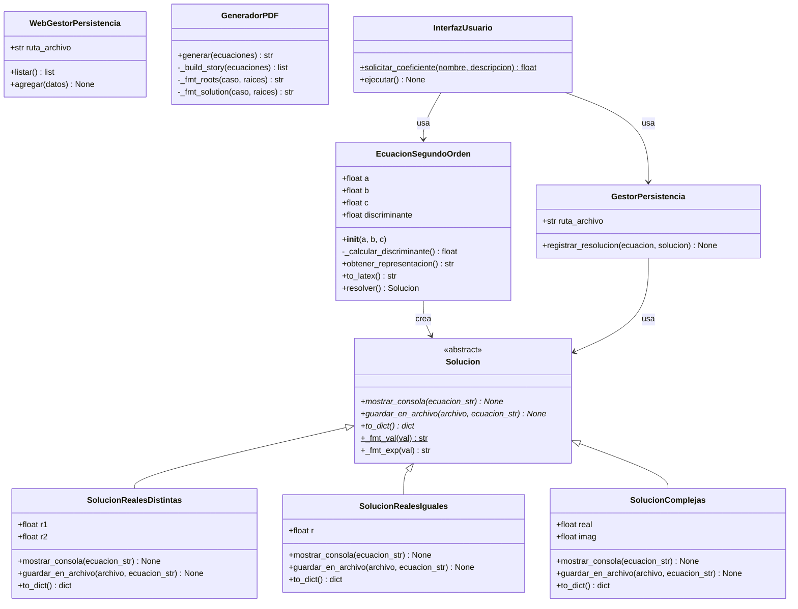
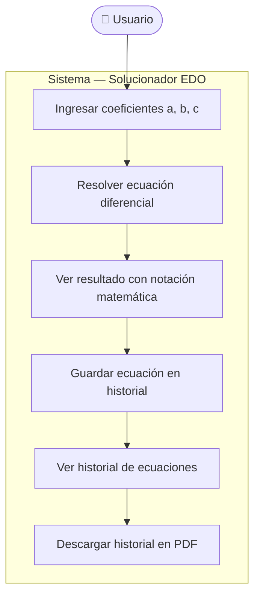
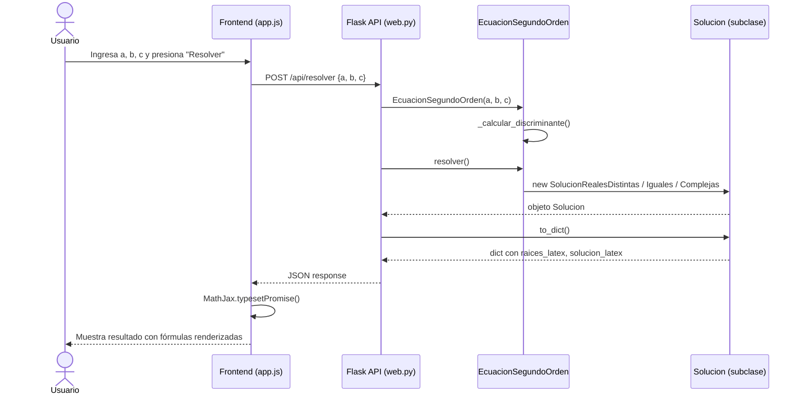
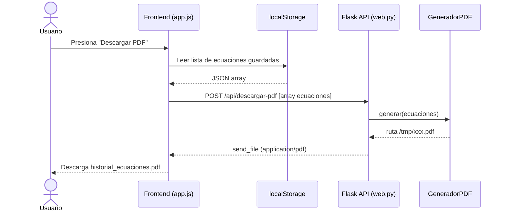

# Solucionador de Ecuaciones Diferenciales de 2.º Orden

**Asignatura:** Programación Orientada a Objetos  
**Institución:** UNEMI — Universidad Estatal de Milagro  
**Semestre:** 4.º Semestre  
**Despliegue:** Vercel (rama `master`) · `github.com/tguevaraa/componente_practico_grupo_07`

---

## Objetivo

Desarrollar un motor de resolución analítica para ecuaciones diferenciales ordinarias de segundo orden con coeficientes constantes, aplicando los principios de la POO. El diseño se basa en la separación de responsabilidades (arquitectura en capas), el uso intensivo del polimorfismo y una interfaz web desplegada en la nube.

---

## 1. Enunciado del Problema

### 1.1 Contexto

La resolución de ecuaciones diferenciales del tipo $ay'' + by' + cy = 0$ requiere evaluar el discriminante de su ecuación característica para determinar el tipo de raíces y estructurar la solución general. El sistema ofrece dos interfaces: una **CLI** para uso académico local y una **interfaz web** con renderizado matemático (MathJax), historial de ecuaciones y descarga en PDF.

---

### 1.2 Reglas de Negocio

**Reglas matemáticas:**
- El coeficiente `a` no puede ser 0 (la ecuación dejaría de ser de segundo orden).
- El discriminante $D = b^2 - 4ac$ determina unívocamente el tipo de solución:

| Caso | Condición | Tipo de raíces | Solución general |
|------|-----------|----------------|------------------|
| 1 | D > 0 | Reales y distintas | $y(x) = C_1e^{r_1x} + C_2e^{r_2x}$ |
| 2 | D = 0 | Raíz doble | $y(x) = (C_1 + C_2x)e^{rx}$ |
| 3 | D < 0 | Complejas conjugadas | $y(x) = e^{\alpha x}[C_1\cos(\beta x) + C_2\sin(\beta x)]$ |

**Reglas de persistencia:**
- CLI: cada resolución se anexa en modo *append* a `lista_ecuaciones.txt`.
- Web: el historial se guarda en `localStorage` del navegador (sin estado en servidor).

---

### 1.3 Actores del Sistema

| Actor | Descripción |
|-------|-------------|
| **Usuario** | Estudiante o profesor que ingresa los coeficientes por consola o interfaz web. |
| **Sistema** | Valida entradas, calcula raíces, aplica polimorfismo y persiste los datos. |

---

### 1.4 Escenarios de Uso

**Escenario 1 — Raíces reales distintas:**
El usuario ingresa $a=1$, $b=-3$, $c=2$. El sistema valida $a \neq 0$, calcula $D = 1 > 0$, genera la solución $y(x) = C_1e^{2x} + C_2e^{x}$ y la muestra con notación LaTeX.

**Escenario 2 — Validación (a = 0):**
El usuario ingresa $a=0$. El sistema detecta la violación de la invariante, muestra un error y solicita nuevo ingreso.

---

## 2. Análisis de Requerimientos

### 2.1 Requerimientos Funcionales

| ID | Descripción |
|----|-------------|
| RF-01 | Capturar y validar coeficientes numéricos `a`, `b`, `c`. |
| RF-02 | Validar que el coeficiente `a` sea distinto de cero. |
| RF-03 | Calcular el discriminante de la ecuación característica. |
| RF-04 | Determinar el caso e instanciar el modelo matemático correspondiente. |
| RF-05 | Mostrar la solución general con notación matemática formal. |
| RF-06 | Guardar un historial de ecuaciones resueltas (TXT en CLI / localStorage en web). |
| RF-07 | Descargar el historial en formato PDF con notación matemática. |
| RF-08 | Exponer una API REST para integración con el frontend. |

### 2.2 Requerimientos No Funcionales

| ID | Descripción |
|----|-------------|
| RNF-01 | Arquitectura separada en capas (Dominio, Infraestructura, Presentación). |
| RNF-02 | Uso estricto de POO: abstracción, polimorfismo, encapsulamiento, herencia. |
| RNF-03 | Compatibilidad con Python 3.9+ (sin `match/case`). |
| RNF-04 | Desplegable en Vercel sin configuración de base de datos. |
| RNF-05 | Renderizado matemático de calidad con MathJax 3. |

---

## 3. Arquitectura en Capas

```
┌─────────────────────────────────────────────┐
│              PRESENTATION LAYER              │
│    CLI (InterfazUsuario)  ·  Web (Flask)    │
├─────────────────────────────────────────────┤
│             APPLICATION LAYER                │
│          (orquestación / servicios)          │
├─────────────────────────────────────────────┤
│               DOMAIN LAYER                   │
│   EcuacionSegundoOrden · Solucion (ABC)     │
│   SolucionRealesDistintas                    │
│   SolucionRealesIguales                      │
│   SolucionComplejas                          │
├─────────────────────────────────────────────┤
│            INFRASTRUCTURE LAYER              │
│  GestorPersistencia · WebGestorPersistencia  │
│  GeneradorPDF                                │
└─────────────────────────────────────────────┘
```

| Capa | Responsabilidad |
|------|-----------------|
| **Domain** | Lógica matemática pura. No depende de ninguna otra capa. |
| **Application** | Orquesta la interacción entre dominio e infraestructura. |
| **Infrastructure** | Persistencia en `.txt` (CLI), JSON en `/tmp` (Web), generación de PDF. |
| **Presentation** | Interfaz de consola (`cli.py`) e interfaz web Flask (`web.py`). |

---

## 4. Estructura del Proyecto

```
COMPONENT_PRACTICO/
│
├── app/
│   ├── algoridmo_original/
│   │   └── ao.py                  # Algoritmo monolítico original (referencia)
│   │
│   ├── domain/
│   │   ├── entities.py            # EcuacionSegundoOrden
│   │   └── solutions.py           # Solucion (ABC) + 3 subclases
│   │
│   ├── application/
│   │   └── services.py            # (reservado para orquestación futura)
│   │
│   ├── infrastructure/
│   │   ├── persistence.py         # GestorPersistencia (CLI → .txt)
│   │   ├── web_persistence.py     # WebGestorPersistencia (Web → JSON /tmp)
│   │   └── pdf_generator.py       # GeneradorPDF (ReportLab)
│   │
│   └── presentation/
│       ├── cli.py                 # InterfazUsuario (consola)
│       └── web.py                 # Flask app + rutas API REST
│
├── api/
│   └── index.py                   # Entry point para Vercel
│
├── templates/
│   └── index.html                 # SPA con MathJax 3
│
├── static/
│   ├── app.js                     # Lógica frontend (localStorage, fetch API)
│   └── style.css                  # Estilos
│
├── run.py                         # Punto de entrada CLI
├── run_web.py                     # Punto de entrada web (desarrollo local)
├── vercel.json                    # Configuración de despliegue Vercel
├── requirements.txt               # flask, reportlab
└── .gitignore
```

---

## 5. Análisis de Clases

### 5.1 Identificación de Conceptos del Dominio

| Concepto | Tipo | Capa | Responsabilidad |
|----------|------|------|-----------------|
| `Solucion` | Clase Abstracta (ABC) | Dominio | Contrato base para mostrar y guardar soluciones. |
| `SolucionRealesDistintas` | Entidad Concreta | Dominio | Estructura el Caso 1 (D > 0). |
| `SolucionRealesIguales` | Entidad Concreta | Dominio | Estructura el Caso 2 (D = 0). |
| `SolucionComplejas` | Entidad Concreta | Dominio | Estructura el Caso 3 (D < 0). |
| `EcuacionSegundoOrden` | Entidad Principal | Dominio | Encapsula coeficientes, evalúa discriminante y crea solución. |
| `GestorPersistencia` | Servicio | Infraestructura | Escribe soluciones en archivo `.txt` (CLI). |
| `WebGestorPersistencia` | Servicio | Infraestructura | Persiste soluciones en JSON en `/tmp` (Web). |
| `GeneradorPDF` | Servicio | Infraestructura | Genera PDF con historial usando ReportLab. |
| `InterfazUsuario` | Controlador | Presentación | Captura entradas por consola y orquesta el flujo CLI. |

### 5.2 Atributos y Métodos por Clase

#### `Solucion` — Clase Abstracta Base

| Elemento | Tipo | Descripción |
|----------|------|-------------|
| `mostrar_consola(ecuacion_str)` | método abstracto | Imprime el resultado en consola. |
| `guardar_en_archivo(archivo, ecuacion_str)` | método abstracto | Escribe el resultado en flujo IO. |
| `to_dict()` | método abstracto | Retorna la solución como dict JSON para la API. |
| `_fmt_val(val)` | método estático | Formatea un float como entero redondeado. |
| `_fmt_exp(val)` | método de instancia | Formatea un coeficiente para un exponente LaTeX. |

#### `EcuacionSegundoOrden` — Entidad Central

| Atributo/Método | Tipo | Descripción |
|-----------------|------|-------------|
| `a`, `b`, `c` | `float` | Coeficientes de la ecuación. |
| `discriminante` | `float` | Calculado en el constructor. |
| `_calcular_discriminante()` | privado | Retorna $b^2 - 4ac$. |
| `obtener_representacion()` | público | Formatea la ecuación como string. |
| `to_latex()` | público | Genera LaTeX limpio para MathJax. |
| `resolver()` | público | Factory: retorna la subclase de `Solucion` correcta. |

#### `GestorPersistencia` — Infraestructura CLI

| Atributo/Método | Descripción |
|-----------------|-------------|
| `ruta_archivo` | Ruta del `.txt` (default: `lista_ecuaciones.txt`). |
| `registrar_resolucion(ecuacion, solucion)` | Abre el archivo en modo append y delega la escritura. |

#### `WebGestorPersistencia` — Infraestructura Web

| Atributo/Método | Descripción |
|-----------------|-------------|
| `ruta_archivo` | JSON en `tempfile.gettempdir()` (`/tmp` en Vercel). |
| `listar()` | Retorna todas las ecuaciones guardadas. |
| `agregar(datos)` | Añade una ecuación con ID y timestamp. |

---

## 6. Diagrama de Clases



---

## 7. Diagrama de Casos de Uso



| ID | Caso de uso | Descripción |
|----|-------------|-------------|
| UC1 | Ingresar coeficientes | El usuario introduce `a`, `b`, `c` en el formulario web o consola. |
| UC2 | Resolver ecuación | El sistema calcula el discriminante y genera la solución. |
| UC3 | Ver resultado | Visualiza raíces y solución general con LaTeX renderizado. |
| UC4 | Guardar ecuación | Guarda la ecuación en `localStorage`. |
| UC5 | Descargar PDF | Descarga el historial en `historial_ecuaciones.pdf`. |
| UC6 | Ver historial | Consulta la lista de ecuaciones de la sesión actual. |

---

## 8. Diagramas de Secuencia

### Resolver Ecuación (Web)



### Descargar PDF



---

## 9. Aplicación de Técnicas POO

| # | Técnica | Cómo se aplica |
|---|---------|----------------|
| 1 | **Abstracción** | `Solucion` usa `abc.ABC` para obligar a las subclases a implementar los métodos de salida, ocultando la complejidad matemática al resto del sistema. |
| 2 | **Polimorfismo** | `GestorPersistencia` e `InterfazUsuario` invocan `solucion.mostrar_consola()` sin importar el caso. La ejecución cambia según la subclase retornada por `resolver()`. |
| 3 | **Encapsulamiento** | `_calcular_discriminante()` es privado en `EcuacionSegundoOrden`; los métodos `_fmt_val` y `_fmt_exp` son privados de `Solucion`. |
| 4 | **Herencia** | Las tres subclases heredan la interfaz de `Solucion` y añaden atributos propios (`r1`, `r2`, `r`, `real`, `imag`). |
| 5 | **Factory Method** | `EcuacionSegundoOrden.resolver()` actúa como fábrica: decide qué subclase de `Solucion` instanciar según el discriminante. |
| 6 | **Inyección de Dependencias** | `GestorPersistencia` pasa el flujo `archivo` directamente a `guardar_en_archivo`, permitiendo escribir sin conocer la ruta o el sistema de archivos. |

---

## 10. Relaciones entre Entidades

| Relación | Clases | Descripción |
|----------|--------|-------------|
| Herencia | `SolucionRealesDistintas`, `SolucionRealesIguales`, `SolucionComplejas` ◁── `Solucion` | Las subclases implementan la clase abstracta. |
| Dependencia (crea) | `EcuacionSegundoOrden` ──► `Solucion` | `resolver()` instancia la subclase correcta. |
| Dependencia (usa) | `GestorPersistencia` ──► `Solucion` | La persistencia delega el formateo a la solución. |
| Dependencia (orquesta) | `InterfazUsuario` ──► `EcuacionSegundoOrden` | La interfaz crea la ecuación y la resuelve. |

---

## 11. API REST

Base URL en producción: `https://<app>.vercel.app`

### `POST /api/resolver`

**Request:**
```json
{ "a": 1, "b": -3, "c": 2 }
```

**Response — Caso 1 (raíces reales distintas):**
```json
{
  "tipo": "Raíces reales y distintas",
  "caso": 1,
  "ecuacion_latex": "y'' - 3y' + 2y = 0",
  "discriminante": 1.0,
  "raices": { "r1": 2.0, "r2": 1.0 },
  "raices_latex": "r_1 = 2, \\quad r_2 = 1",
  "solucion_latex": "y(x) = C_1\\, e^{2x} + C_2\\, e^{x}"
}
```

**Response — Caso 2 (raíz doble):**
```json
{
  "tipo": "Raíces reales e iguales",
  "caso": 2,
  "raices": { "r": -1.0 },
  "raices_latex": "r = -1 \\;(\\text{raíz doble})",
  "solucion_latex": "y(x) = (C_1 + C_2\\, x)\\, e^{-x}"
}
```

**Response — Caso 3 (complejas):**
```json
{
  "tipo": "Raíces complejas conjugadas",
  "caso": 3,
  "raices": { "real": 0.0, "imag": 3.0 },
  "raices_latex": "r = 0 \\pm 3\\,i",
  "solucion_latex": "y(x) = C_1 \\cos(3x) + C_2 \\sin(3x)"
}
```

### `POST /api/descargar-pdf`
Recibe un array de ecuaciones en el body y retorna `historial_ecuaciones.pdf`.

### `GET /api/ecuaciones`
Retorna la lista de ecuaciones guardadas en el servidor.

---

## 12. Tecnologías

| Componente | Tecnología |
|---|---|
| Lenguaje | Python 3.9+ |
| Framework web | Flask |
| Renderizado de fórmulas | MathJax 3 (CDN) |
| Generación de PDF | ReportLab |
| Despliegue | Vercel (`@vercel/python`) |
| Almacenamiento web | `localStorage` del navegador |
| Control de versiones | Git / GitHub |

---

## 13. Cómo Ejecutar

### Modo consola (CLI)

```bash
python run.py
```

### Modo web (desarrollo local)

```bash
pip install flask reportlab
python run_web.py
# Abrir http://localhost:5000
```

### Despliegue en Vercel

1. Hacer push a la rama `master` en GitHub.
2. Vercel detecta `vercel.json` y despliega `api/index.py` con `@vercel/python`.
3. La app queda disponible en la URL asignada automáticamente.

---

## 14. Decisiones de Diseño

| Decisión | Motivo |
|----------|--------|
| `localStorage` en lugar de base de datos | Vercel tiene sistema de archivos de solo lectura en `/var/task/`. No hay estado persistente entre invocaciones serverless. |
| `/tmp` para archivos temporales | Única ruta escribible en Vercel; `tempfile.gettempdir()` devuelve `/tmp`. |
| `if/elif/else` en lugar de `match/case` | `match/case` requiere Python 3.10+; Vercel usaba Python 3.9 por defecto. |
| `POST` en `/api/descargar-pdf` | En producción el cliente envía las ecuaciones en el body (el servidor no tiene estado); en local se leen del archivo JSON. |
| MathJax 3 CDN | Renderizado de LaTeX de calidad sin dependencias de servidor ni librerías Python adicionales. |
